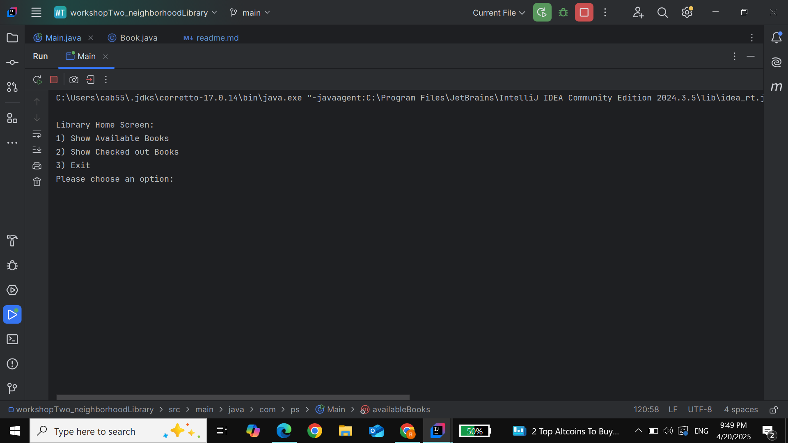
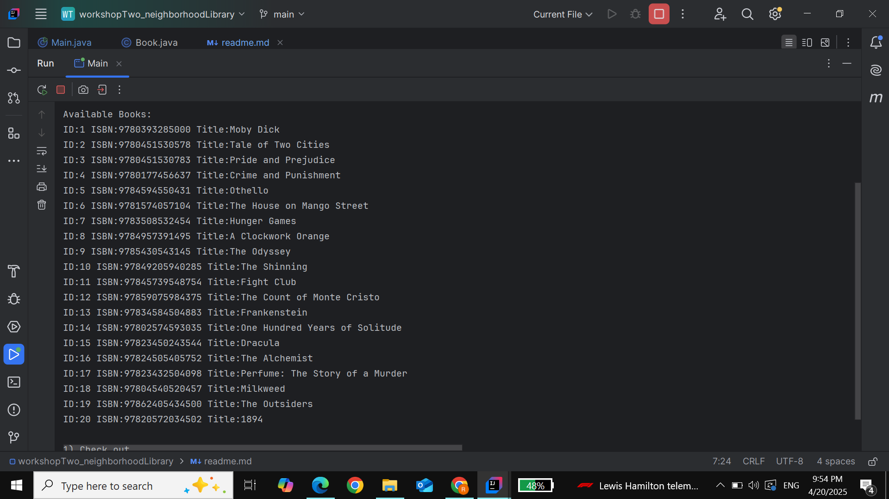
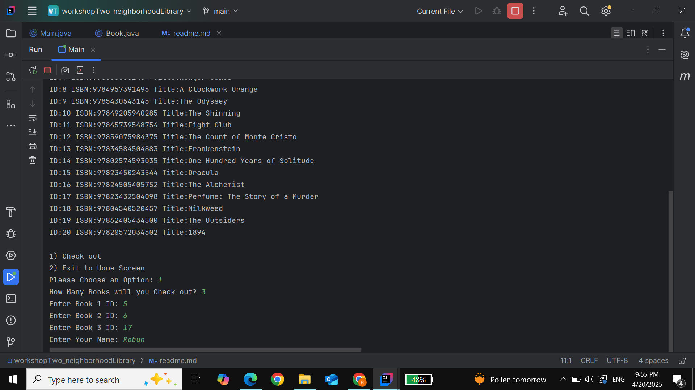
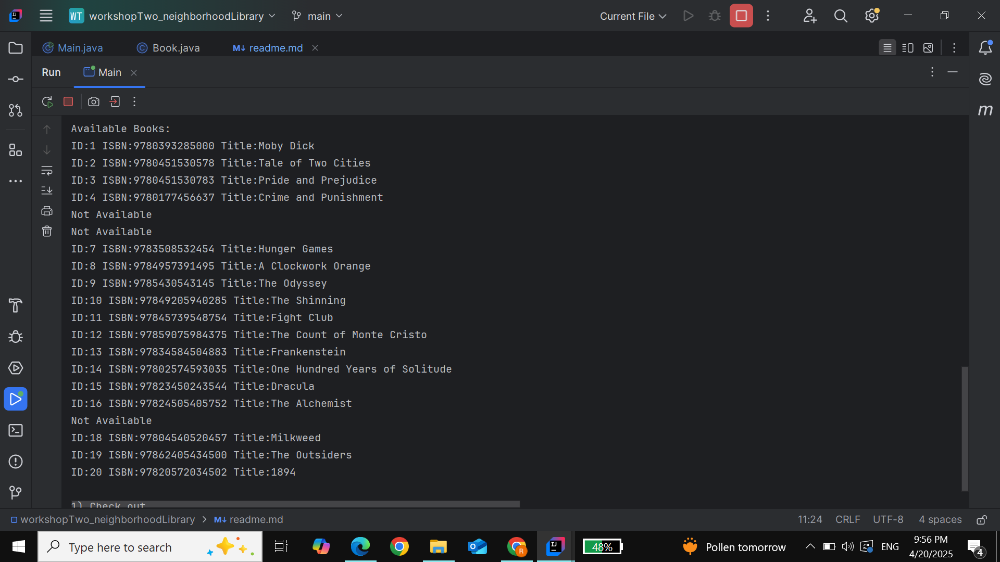
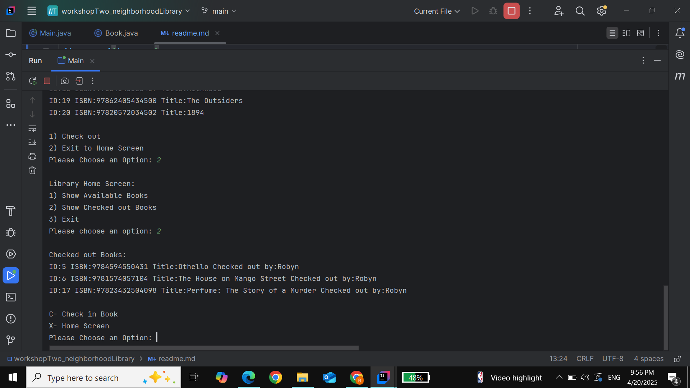
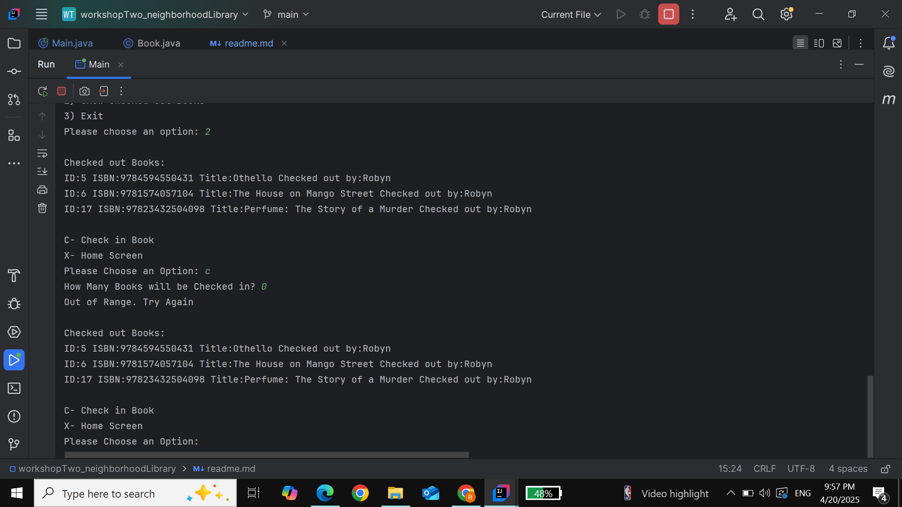
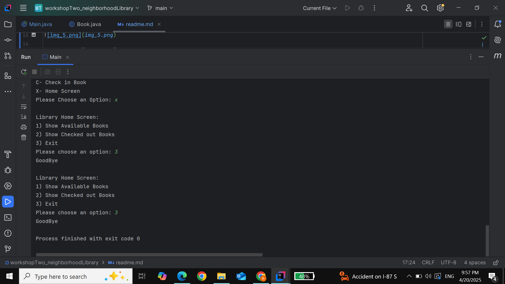

# Neighborhood Library 
## scanner.nextLine(); 
After some research, I've added this to consume the previous empty line
so that the next scanner won't skip the actual input. I have now learned
that you cannot use a string input after an int input without putting a buffer

